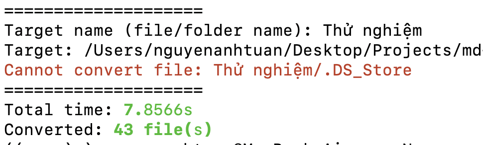

# Convert to Markdown Test

Đây là repo thử nghiệm convert từ các file documents, media, ... sang Markdown.

## Benchmark

Hiện tại thì có thể xử lý khoảng 43 files trong 7.8s (máy mạnh thì có thể nhanh hơn).



## Change logs

Hiện tại phiên bản 0.1.0 hỗ trợ:

- Convert 1 file duy nhất.
- Convert nhiều file.

## Installation

Đầu tiên thì phải tạo môi trường ảo trước.

```bash
python3 -m venv venv
```

Tiếp theo là activate môi trường ảo.

```bash
source ./venv/bin/activate
```

Sau đó tiến hành cài đặt packages.

```bash
pip install -r requirements.txt
```

> Note: bài này được thử nghiệm trên Python 3.12.

### Warnings

Có một số lưu ý trong quá trình chạy script:

#### RuntimeWarning: Couldn't find ffmpeg or avconv - defaulting to ffmpeg, but may not work

Trường hợp này là do máy chưa cài các công cụ thích hợp để đọc ffmpeg hay avconv. Vì thế mà để khắc phục thì mình chỉ cần cài ffmpeg là được:

- Với Windows: cài ffmpeg từ https://ffmpeg.org/download.html, sau đó giải nén và thêm thư mục bin vào biến môi trường **PATH**.
- Với MacOS: cài từ brew.

```bash
brew install ffmpeg
```

- Với Linux: cài với apt, yum, ...

```bash
sudo apt-get update
sudo apt-get install ffmpeg
```

## How to run?

Để chạy thì gõ lệnh

```bash
python src/main.py
```

Sau đó thì điền các thông tin tương ứng.